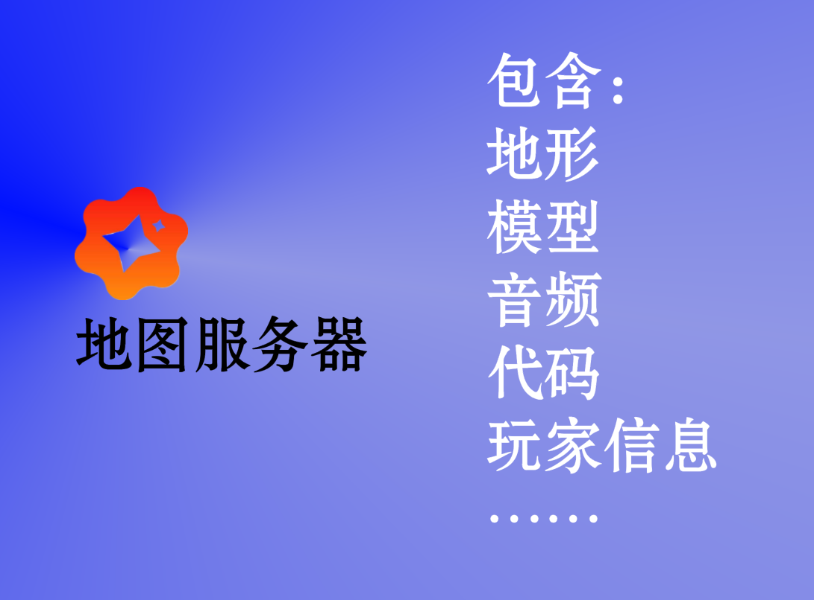
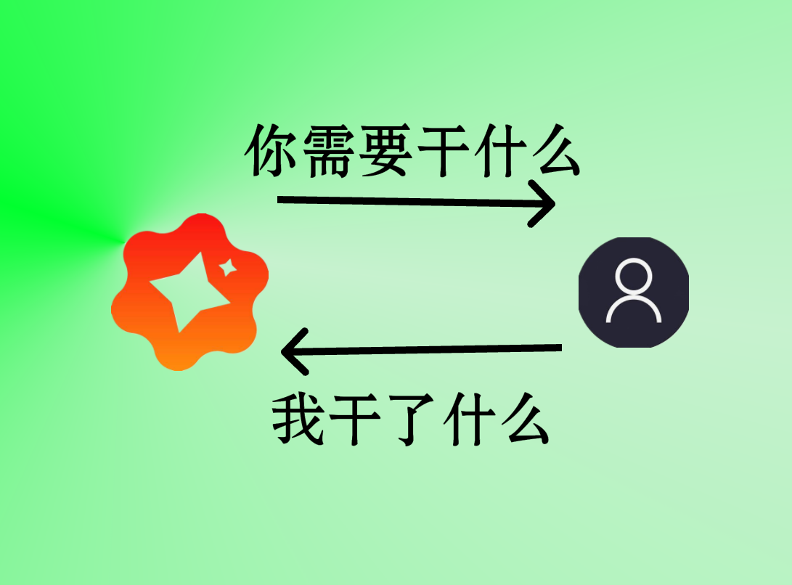
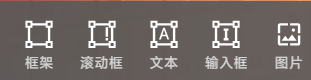
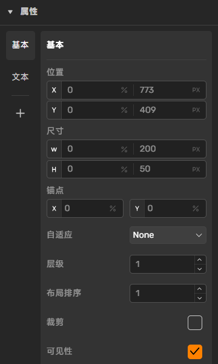
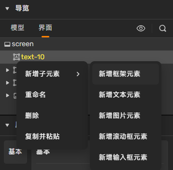
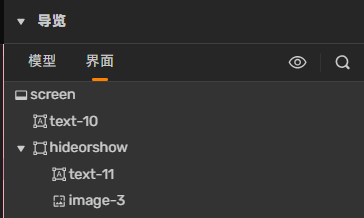

# 说明

本文档对岛三GameUi的图片、文字、输入框等进行了解释和使用示范

本文档会在代码前方说明文件名称，如果是“index.js”，请将代码写在“Server”下，如果是“clientIndex.js”请将代码写在“Client”下（见如图代码左侧）


# 服务器？客户端？

我们常常听到这两个名词，但是并不是很了解，那么在制作GameUi前，我们必须对这两个名词有一定了解

服务器（server）：地形、模型、音频、代码、玩家信息等等。服务器负责管理所有玩家，包括私发消息、控制玩家皮肤等等



客户端（client）：玩家游玩地图所使用的设备，向服务器请求地图数据并处理后显示在你的屏幕上，同时也会将你的信息上传给服务器


关系：



当然，客户端可以不止一个（一个地图肯定不止能容纳1个玩家吧？）


举个栗子：

```javascript
world.onPlayerJoin(({entity})=>{
	world.say(`${entity.player.name}加入了游戏！`)
})
```

当一个玩家加入游戏的时候，服务器会给在线所有的玩家客户端发送消息，在屏幕上方显示一条“[玩家的名字]加入了游戏！”，让我们知道有一个新玩家加入了

# 信息交流

那么，我们现在来了解一下服务器和客户端之间如何进行“交流”

## 客户端给服务器发消息

```javascript
// clientIndex.js
remoteChannel.sendServerEvent({你要发送的消息})
```

这个“你要发送的消息”几乎可以是任何东西，比如字符串、数字、字典等

## 服务器给客户端发消息

```javascript
// index.js
remoteChannel.sendClientEvent(发送给的玩家, {要发送的消息})
```

发送的消息同样可以是上面说的那些，但是有一点不同，由于服务器管理着多个玩家（有多个玩家进行游戏），就需要指定发给哪个玩家（即使只有一个玩家在线也需要这样！）

## 客户端接收服务器消息

```javascript
// clientIndex.js
remoteChannel.events.on("client",(arg)=>{执行的代码})
```

当客户端接收到服务器的消息后，会自动执行代码，同时消息的内容将会存储到“arg”中

## 服务器接收客户端消息

```javascript
// index.js
remoteChannel.onServerEvent(({entity, args, tick})=>{执行的代码})
```

entity:发送消息的客户端对应的玩家

args:消息

tick:发送的时间

## 示例

当玩家加入游戏（clientIndex.js会自动运行）时向服务器发送消息“hi！”，服务器接到消息后将对应用户~~友好地打招呼~~踢出

```javascript
// clientIndex.js
remoteChannel.sendServerEvent({'hi!'})
// index.js
remoteChannel.onServerEvent(({entity, args, tick})=>{
	entity.player.kick()
})
```

## 完善

通过对上面代码的阅读，相信你已经发现：发送消息的时候并不会对消息的类型进行区分，这就导致我们在处理消息的时候产生很大的麻烦

我们可以将发送消息的内容变成一个字典，type表示这条消息的类型，args可以嵌套一个字典，里面包含你要传输的所有内容，如下：

```json
{
	type: "消息类型"
	args: {
		内容1: "内容1"
		内容2: "内容2"
	}
}
```

我们以客户端接收服务器消息为例

```javascript
// clientIndex.js
remoteChannel.events.on("client",(arg)=>{
	if(arg.type=='类型1'){
		// 执行对应代码
	}
	else if(arg.type=='类型2'){
		// 执行对应代码
	}
})
```


---


# GameUi

讲了这么多服务器和客户端的知识，只是在为GameUi的教程做铺垫而已。

## 创建

### 手动创建

你会发现在编辑器最顶上一栏有一个“界面”，你可以在这里面手动创建各种类型的GameUi，在本文档发布时已有以下几种：

（点击任何一个类型的ui即可创建）



框架（UiBox）：你可以在里面放入任何类型的ui，相当于一个组

滚动框：一个可以上下滚动的内容区，其它类型的ui只有被它包含才能跟随着滚动

文本（UiText）：一个文本框

输入框（UiInput）：用户可以在里面输入文字

图片（UiImage）：可以放置一张图片

**优势：手动创建UI可以在编辑器内直接通过鼠标拖动来调整布局，并且也可以通过代码来控制**

点击展开右边栏后（展开后会变成橙色），你可以看到你刚刚创建的ui



你可以在“属性”一栏中更改它的属性（如位置、尺寸、字体颜色等等）

右键任意一个类型的ui，你可以给它添加子元素，子元素会随着父元素一起移动、缩放等等



（请注意：任何类型的ui都是可以添加子元素的，但如果你想让你的界面井井有条，推荐在“框架（UiBox）”下添加子元素，同时，子元素里的任何ui也是可以再次套娃添加子元素的）

### 代码创建

你可以使用诸如下面这样的代码进行创建

```javascript
// clientIndex.js
const text1 = new UiBox()
```

**请注意：如果你要用代码创建GameUi，必须在clientIndex.js中写代码，否则无法正常创建（本来就是嘛，不然服务器哪知道要给哪个玩家创建呢？）；使用代码创建的ui只有在地图运行之后才会生效，而手动创建的则在任何时候都看得见**

## 属性

获得GameUi对象之后，这些对象都有一些属性

### 通用

```javascript
// clientIndex.js
const object = 任何GameUi对象
object.visible = true // 可见性，true为可见，false为不可见（隐藏）
object.position.offset.x = 1 // 位置设置
object.position.offset.y = 1
object.position.offset.z = 1
```

### textContent

UiText和UiInput可用，为文字内容，可用于设置文字内容和获取文字内容（输入）

```javascript
// clientIndex.js
const text = Uitext或者UiInput对象
text.textContent = '这是文字内容'
```

### image

适用于UiImage，设置图片url

```javascript
// clientIndex.js
const image = 任何图片对象
image.image = 'https://azkbbys.github.io/files/bg.png'
```

image内容可以为外部图片链接或者地图文件中的图片文件路径，可在左上方“文件”->“图片”->点击你要添加的图片->“详情”->“位置”，点击一下就可以复制了


## 获取Ui对象

在上面我们说过可以手动创建一个GameUi，但是如何从代码中控制它呢？

比如我创建了一个“text-10”的文本对象（直接放在屏幕上，没有其它的父对象），在代码中只需要这样就可以找到它

```javascript
// clientIndex.js
ui.findChildByName('text-10')
```

你可以通过这样来存储它

```javascript
// clientIndex.js
const text10 = ui.findChildByName('text-10')
```

其中，“ui”代表着整个屏幕，你可以理解为“ui”就是右边栏中显示的“screen”


任何的对象都要从它开始查找

示例：

现在我的UI结构是这样



如何找到“hideorshow”下方的“text-11”？

```javascript
// clientIndex.js
ui.findChildByName('hideorshow').findChildByName('text-11')
```

## 按钮

```javascript
// clientIndex.js
const arrow = ui.findChildByName('hideorshow')
arrow.events.on("pointerdown",()=>{
    // 执行的代码
})
```

当一个叫“hideorshow”的元素被点击后执行代码

**注意：这样检测可以检测任何类型的元素（包括UiText、UiImage等等）**

## UiScale

你可以简单地理解为这个玩意就是用来适应不同的屏幕尺寸的

UiScale只能用代码创建。

```javascript
const uiScale = UiScale.create();// 创建
uiScale.scale = screenWidth / 1500; // 按宽度进行缩放，预设渲染分辨率x值为 1366px
ui.uiScale = uiScale// 将uiScale应用到整个屏幕的ui缩放
```

---

# 范例


```javascript
var time = ''
var open = true

const uiScale = UiScale.create();
uiScale.scale = screenWidth / 1500; // 按宽度进行缩放，预设渲染分辨率x值为 1366px
ui.uiScale = uiScale
remoteChannel.events.on("client",(arg)=>{
    if(arg.type=='玩家信息1'&&open==true){
        ui.findChildByName('image-0').imageOpacity=0.7
        ui.findChildByName('image-0').findChildByName('image-1').imageOpacity=0.5
        ui.findChildByName('image-0').findChildByName('image-1').image = arg.args.avatar
        ui.findChildByName('image-0').findChildByName('text-1').textContent = arg.args.name
        ui.findChildByName('image-0').findChildByName('text-2').textContent = arg.args.player_title
        ui.findChildByName('image-0').findChildByName('text-3').textContent = '世界信息'
        ui.findChildByName('image-0').findChildByName('text-5').textContent = '玩家信息'
        ui.findChildByName('image-0').findChildByName('text-7').textContent = '聊天消息'
    }
    else if(arg.type=='command'){
        if(arg.args=='close'){
            open=false
            ui.findChildByName('image-0').findChildByName('image-1').imageOpacity=0
            ui.findChildByName('image-0').findChildByName('text-1').textContent = ''
            ui.findChildByName('image-0').findChildByName('text-2').textContent = ''
            ui.findChildByName('image-0').findChildByName('text-3').textContent = ''
            ui.findChildByName('image-0').findChildByName('text-4').textContent = ''
            ui.findChildByName('image-0').findChildByName('text-5').textContent = ''
            ui.findChildByName('image-0').findChildByName('text-6').textContent = ''
            ui.findChildByName('image-0').findChildByName('text-7').textContent = ''
            ui.findChildByName('image-0').findChildByName('text-8').textContent = ''
            ui.findChildByName('image-0').imageOpacity=0
        }
        else if(arg.args=='open'){
            open=true
        }
        else if(arg.args=='opencmd'){
            ui.findChildByName('command').visible=true
        }
        else if(arg.args=='closecmd'){
            ui.findChildByName('command').visible=false
        }
    }
    else if(arg.type=='世界信息'&&open==true){
        if(arg.args.time[1]<=0){
            time='抓捕时间：'+String(Math.floor(arg.args.time[0]/16))
        }
        else{
            time='躲藏时间：'+String(Math.floor(arg.args.time[1]/16))
        }
        ui.findChildByName('image-0').findChildByName('text-4').textContent=`剩余抓捕者：${arg.args.zbzrs}人\n剩余躲藏者：${arg.args.dczrs}人\n剩余${time}秒${time.startsWith('抓捕时间')&&parseInt(time.slice(5))>0?`\n模式：${arg.args.mode[0]}:${arg.args.mode[1]}`:``}`
        ui.findChildByName('image-0').findChildByName('text-8').textContent=arg.args.message
    }
    else if(arg.type=='玩家信息2'&&open==true){
        ui.findChildByName('image-0').findChildByName('text-6').textContent=`胜利场数：${arg.args.wintimes}场\n经验：${arg.args.exp}\n位置：x${Math.floor(arg.args.x)},y${Math.floor(arg.args.y)},z${Math.floor(arg.args.z)}`
    }
    // 保留备用
    // else if(arg.type=='广播'){
    //     ui.findChildByName('image-0').findChildByName('text-0').textContent='世界广播：'+arg.args.text
    // }
})
async function sendandclear(cmdneirong,zxcommand,ok){
    zxcommand.visible=false
    ok.visible=false
    remoteChannel.sendServerEvent({
        type:'zxcommand',
        cmd:cmdneirong.textContent
    })
    cmdneirong.textContent=''
    await sleep(3000)
    zxcommand.visible=true
    ok.visible=true
}
const zxcommand = ui.findChildByName('command').findChildByName('image-2')
const cmdneirong = ui.findChildByName('command').findChildByName('commandinput')
zxcommand.events.on("pointerdown",()=>{
    sendandclear(cmdneirong,zxcommand,ui.findChildByName('command').findChildByName('text-9'))
})
async function hide(object,y,visible){
    while(object.position.offset.y>y+1){
        object.position.offset.y+=(y-object.position.offset.y)/50
        await sleep(1)
    }
    object.position.offset.y=y
    object.visible=visible
}
async function show(object,y,visible){
    object.visible=visible
    while(object.position.offset.y<y-1){
        object.position.offset.y+=(y-object.position.offset.y)/50
        await sleep(1)
    }
    object.position.offset.y=y
}
const arrow = ui.findChildByName('hideorshow')
arrow.events.on("pointerdown",()=>{
    if(arrow.position.offset.y>0){
        hide(arrow,0,true)
        hide(ui.findChildByName('image-0'),-378,false)
        arrow.findChildByName('text-11').textContent='↓'
    }
    else{
        show(arrow,331,true)
        show(ui.findChildByName('image-0'),0,true)
        arrow.findChildByName('text-11').textContent='↑'
    }
})
```
